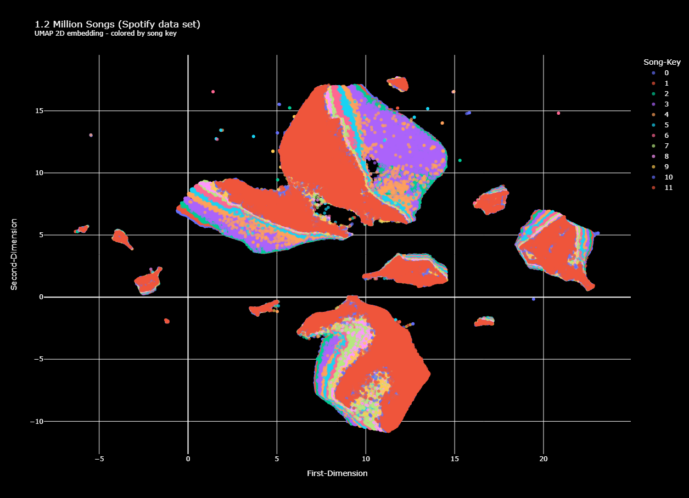

# Music recommender system 🎸

... uses
[this](https://www.kaggle.com/datasets/rodolfofigueroa/spotify-12m-songs)
Spotify data set with 1.2 million songs with features such as danceability,
energy, key, acousticness, etc.

The below plot visualizes the whole data set (reduced to 2 dimension with 
UMAP).

